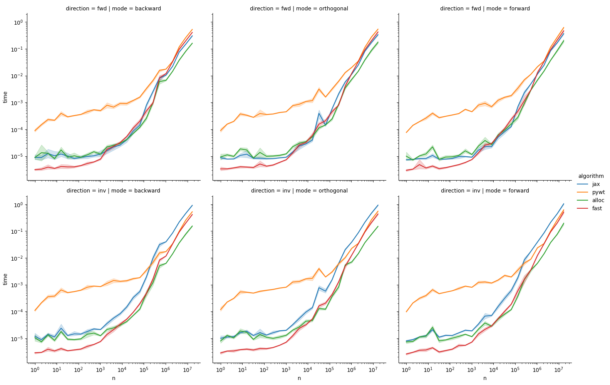

# haar-wavelet

In-place, linear time algorithms for the [Haar wavelet
transform](https://en.wikipedia.org/wiki/Haar_wavelet#Haar_transform),
implemented in [Cython](https://cython.org/) and
[JAX](https://jax.readthedocs.io/en/latest/).

We also compare against
[PyWavelets](https://pywavelets.readthedocs.io/en/latest/index.html),
obtaining over an order of magnitude speedup for small (< 10^5) lists.

## Experimental results

### Haar transform

### Even-odd

